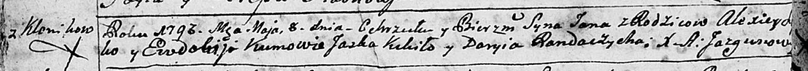

**Ян Алексеев (Jan)**

8 мая 1793 г -- крещение (НИАБ 136-13-894, лист 19об, №38/1793-р
(ориг)).

**НИАБ 136-13-894:** Лист 19-об. **Метрическая запись №38/1793-р
(ориг).**

Дедиловичская Покровская церковь. 8 мая 1793 года. Метрическая запись о
крещении.

\...ko Jan -- сын родителей с деревни Клинники.

\...ko Alexiey -- отец.

\...ko Ewdokija -- мать.

Kikiło Jaśka - кум.

Randaczycha Daryia - кума.
