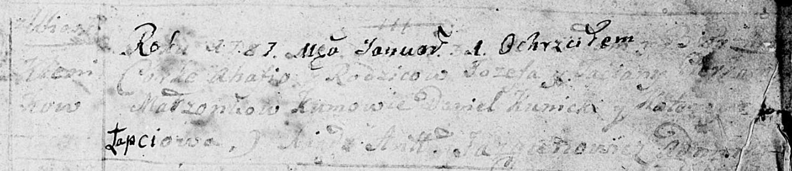

**Агафия Иосифова (Ahafia)**

1 января 1787 г -- крещение (НИАБ 136-13-894, лист 1, №1/1787-р (ориг)).

**НИАБ 136-13-894:** Лист 1. **Метрическая запись №1/1787-р (ориг).**

Дедиловичская Покровская церковь. 1 января 1787 года. Метрическая запись
о крещении.

? Ahafia -- дочь родителей с деревни Клинники.

? Jozef -- отец.

? Taciana -- мать.

Kunicki Daniel -- кум.

Łapciowa Katerzyna - кума.

Jazgunowicz Antoniusz -- ксёндз.
