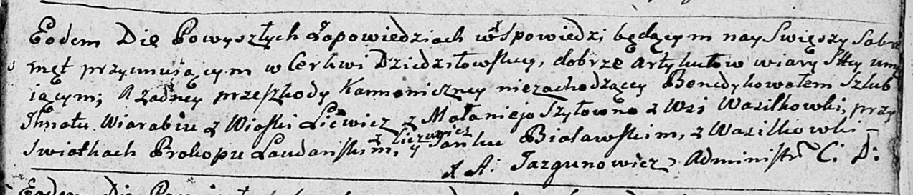

**Лявданский Пракоп (Laudanski Prakop)**

7 октября 1792 г -- свидетель при венчании Игната Воробья с деревни
Литвичи с Маланией Шило с деревни Васильковка (НИАБ 136-13-894, лист 71,
№13/1792-б (ориг)).

**НИАБ 136-13-894:** Лист 71. **Метрическая запись №13/1792-б (ориг).**

Дедиловичская Покровская церковь. 7 октября 1792 года. Метрическая
запись о венчании.

Wiarabiey Jhnat -- жених, с деревни Лицвичи.

Szyłowna Małanieja -- невеста, с деревни Васильковка.

Laudanski Prakop -- свидетель, с деревни Лицвичи.

Bialawski Janka -- свидетель, с деревни Васильковка.

Jazgunowicz Antoni -- ксёндз.
