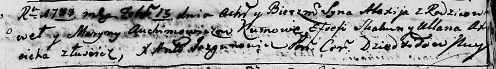

**Авхимович Марына (Auchimowiczowa Maryna)**

13 февраля 1788 г -- крещение сына Алексея (НИАБ 136-13-894, лист 4,
№19/1788-р (ориг)).

**НИАБ 136-13-894:** Лист 4. **Метрическая запись №19/1788-р (ориг).**

Дедиловичская Покровская церковь.13 февраля 1788 года. Метрическая
запись о крещении.

Auchimowicz Alexij -- сын родителей с деревни Лустичи.

Auchimowicz Paweł? -- отец.

Auchimowicz Maryna -- мать.

Skakun Efsefi - кум.

Axiucicha Ullana - кума.

Jazgunowicz Antoniusz -- ксёндз.
