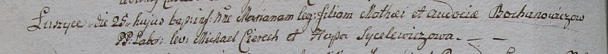

**Баханович Матей (Bochanowicz Mathei)**

25 марта 1799 г -- крещение дочери Марьяны (НИАБ 1781-27-199, лист 125,
№21/1799-р).

**НИАБ 1781-27-199:** Лист 125об. **Метрическая запись №21/1799-р.**
(см.тж. лист 125об, запись №21)

Дедиловичский костел Наисвятейшего Сердца Иисуса. 25 марта 1799 года.
Метрическая запись о крещении.

Bochanowiczowna Mariana -- дочь крестьян с деревни Лустичи.

Bochanowicz Mathei -- отец.

Bochanowiczowa Audocia -- мать.

Cierech Michael -- крестный отец.

Sycelewiczowa Hapa - крестная мать.

Linhart Hyacinthus -- ксёндз.
