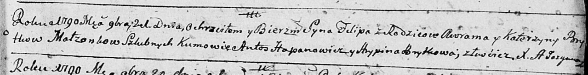

**Бритко Катерина (Brytkowa Katerzyna)**

21 ноября 1790 г -- крещение сына Филипа (НИАБ 136-13-894, лист 12,
№85/1790-р (ориг)).

**НИАБ 136-13-894:** Лист 12. **Метрическая запись №85/1790-р (ориг).**

Дедиловичская Покровская церковь. 21 ноября 1790 года. Метрическая
запись о крещении.

Brytko Filip -- сын родителей с деревни Лустичи.

Brytko Awram -- отец.

Brytkowa Katerzyna -- мать.

Hapanowicz Antoś - кум.

Brytkowa Hrypina - кума.

Jazgunowicz Antoni -- ксёндз.
