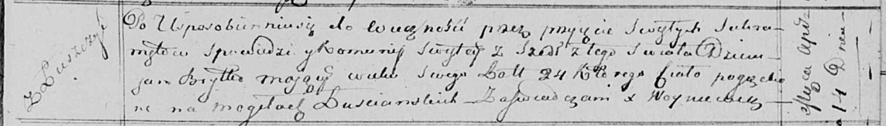

**Сушко (в девичестве Брытко) Марыя (Szuszkowa Marija z Brytkow)**

10 ноября 1810 г -- венчание с молодым Габриэлем Сушко с деревни
Замосточье (НИАБ 136-13-920, лист 17, №9/1810-б (ориг)).

**НИАБ 136-13-920:** Лист 17. **Метрическая запись №9/1810-б (ориг).**

{width="6.496527777777778in"
height="1.3316240157480315in"}

Осовская Покровская церковь. 10 ноября 1810 года. Метрическая запись о
венчании.

Szuszko Gabriel -- жених, молодой, парафии Осовской, с деревни
Замосточье.

Brytkowna Marya -- невеста, девка, парафии Осовской, с деревни Лустичи.
Семья в деревне Лустичи.

Audziuchowicz Łukjan -- свидетель.

Brytka Dziemian -- свидетель.

Woyniewicz Tomasz -- ксёндз.
