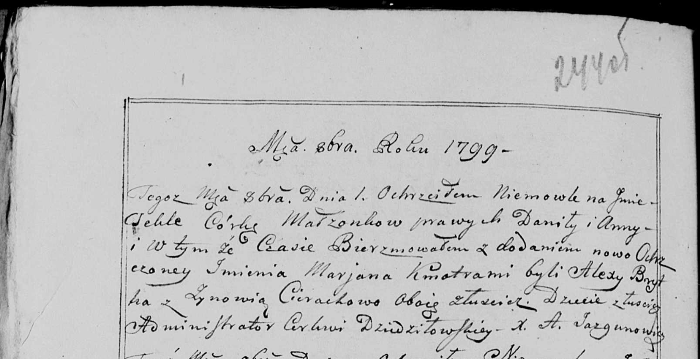

**Брытко Алексы (Brytko Alexy)**

1 октября 1799 г -- крестный отец Текли Марьяны, дочери Дедёнков Данилы
и Анны с деревни Лустичи (НИАБ 136-13-938, лист 244об, №37/1799-р (коп))

**НИАБ 136-13-938:** Лист 244об. **Метрическая запись №37/1799-р
(коп).**

(См. тж. НИАБ 136-13-894, лист 39об, №39/1799-р (ориг), РГИА 823-2-18,
лист 272об, №38/1799-р (коп))

Дедиловичская Покровская церковь. 1 октября 1799 года. Метрическая
запись о крещении.

\[Dziedzeńkowna\] Tekla Marjana -- дочь родителей с деревни Лустичи.

\[Dziedzenok\] Daniła -- отец.

\[Dziedzeńkowa\] Anna -- мать.

Brytka Alexy -- кум, с деревни Лустичи.

Cierachowa Zynowia - кума, с деревни Лустичи.

Jazgunowicz Antoni -- ксёндз.
