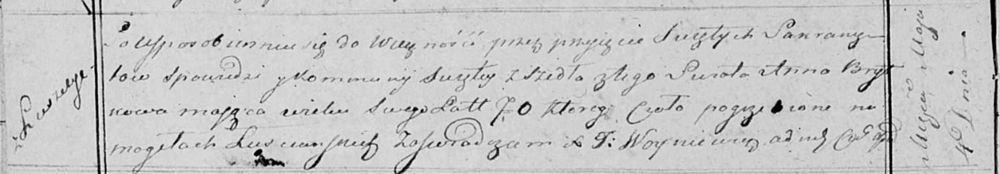

**Брытко Анна (Brytkowa Anna)**

4 мая 1819 г -- отпевание, умерла в возрасте 70 лет (родилась около 1749
г) (НИАБ 136-13-919, лист 32об, №3/1819-у (ориг)).

**НИАБ 136-13-919:** Лист 32об. **Метрическая запись №3/1819-у (ориг).**

Осовская униатская церковь. 4 мая 1819 года. Метрическая запись об
отпевании.

Brytkowa Anna -- умершая, 70 лет, с деревни Лустичи, похоронена на
кладбище деревни Лустичи.

Woyniewicz Tomasz -- ксёндз.
