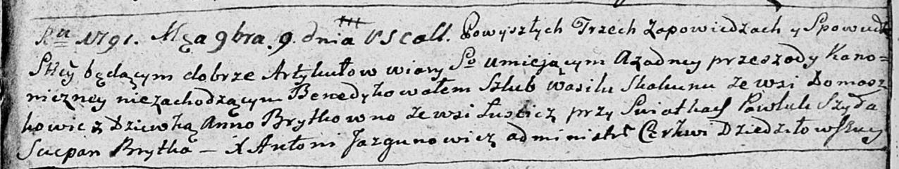

**Брытко (Скакун) Анна (Skakunowa Anna z Brytkow)**

9 сентября 1791 г -- венчание с Василём Скакуном с деревни Домашковичи
(НИАБ 136-13-894, лист 70, №15/1791-б (ориг)).

**НИАБ 136-13-894:** Лист 70. **Метрическая запись №15/1791-б (ориг).**

Дедиловичская Покровская церковь. 9 сентября 1791 года. Метрическая
запись о венчании.

Skakun Wasil -- жених, с деревни Домашковичи.

Brytkowna Anna -- невеста, с деревни Лустичи.

Szyło Pawluk -- свидетель.

Brytka Sciepan -- свидетель.

Jazgunowicz Antoni -- ксёндз.
