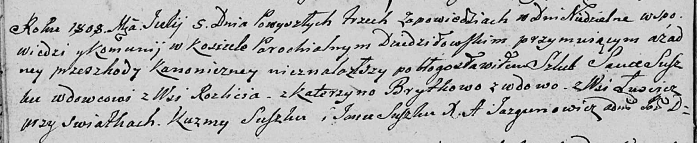

**Сушко (в предыдущем браке Брытко) Катерына (Suszkowa (Brytkowa)
Katerzyna)**

5 июля 1808 г -- венчание с вдовцом Савкой Сушко с деревни Разлитье
(НИАБ 136-13-920, лист 13об, №3/1808-б (ориг)).

**НИАБ 136-13-920:** Лист 13об. **Метрическая запись №3/1808-б (ориг).**

{width="6.496527777777778in"
height="1.338999343832021in"}

Дедиловичская Покровская церковь. 5 июля 1808 года. Метрическая запись о
венчании.

Suszko Sauka -- жених, вдовец, с деревни Разлитье.

Brytkowa Katerzyna -- невеста, вдова, с деревни Лустичи.

Suszko Kuzma -- свидетель.

Suszko Jan -- свидетель.

Jazgunowicz Antoni -- ксёндз.
