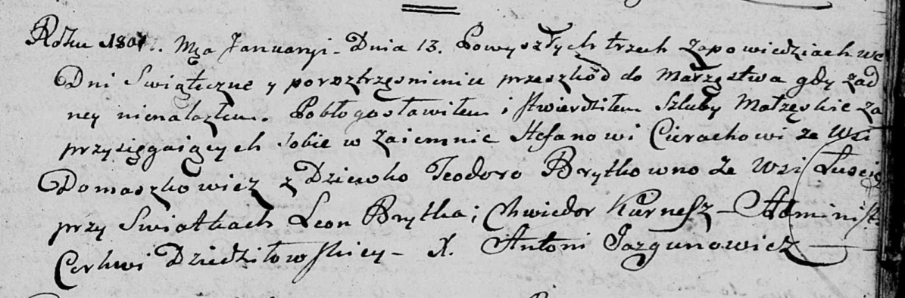

**Церах (Брытко) Тодора (Cierachowa Teodora z Brytkow)**

13 января 1801 г -- венчание на Степане Церахе с деревни Домашковичи
(НИАБ 136-13-920, лист 7, №1/1801-б (ориг)).

**НИАБ 136-13-920:** Лист 7. **Метрическая запись №1/1801-б (ориг).**

Дедиловичская Покровская церковь. 13 января 1801 года. Метрическая
запись о венчании.

Cierach Stefan -- жених, с деревни Домашковичи.

Brytkowna Teodora -- невеста, девка, с деревни Лустичи.

Brytka Leon -- свидетель.

Kurnesz Chwiedor -- свидетель.

Jazgunowicz Antoni -- ксёндз.
