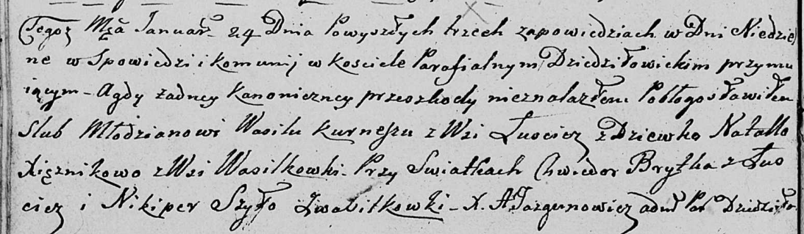

**Брытко Хведор (Brytko Chwiedor)**

24 января 1809 г -- свидетель венчания Василя Курнеша с деревни Лустичи
с девкой Натальей Ксёнжник с деревни Васильковка (НИАБ 136-13-920, лист
14об, №2/1809-б (ориг)).

**НИАБ 136-13-920:** Лист 14об. **Метрическая запись №2/1809-б (ориг).**

Дедиловичская Покровская церковь. 24 января 1809 года. Метрическая
запись о венчании.

Kurnesz Wasil -- жених, с деревни Лустичи.

Xięznikowa Natalla -- невеста, девка, с деревни Васильковка.

Brytka Chwiedor -- свидетель, с деревни Лустичи.

Szyło Nikiper -- свидетель, с деревни Васильковка.

Jazgunowicz Antoni -- ксёндз.
