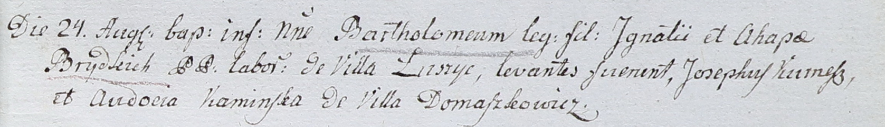

**Бритко Агафия (Brytkowa Ahafija, Ahapa)**

24 августа 1802 г -- крещение сына Бартоломея (НИАБ 937-4-32, лист 7,
№24/1802-р).

22 июля 1805 г -- крещение дочери Анны Евы (НИАБ 136-13-894, лист 57об,
№33/1805-р (ориг)).

**НИАБ 937-4-32:** Лист 7. **Метрическая запись №24/1802-р.**

{width="6.496527777777778in"
height="0.9416666666666667in"}

Дедиловичский костел Наисвятейшего Сердца Иисуса. 24 августа 1802 года.
Метрическая запись о крещении.

Brydko Bartołomiey -- сын крестьян с деревни Лустичи.

Brydko Jgnati -- отец.

Brydkowa Ahapa -- мать.

Kurnesz Joseph -- крестный отец, с деревни Домашковичи.

Kaminska Audocia -- крестная мать, с деревни Домашковичи.

Linhart Hyacinthus -- ксёндз.

**НИАБ 136-13-894:** Лист 57об. **Метрическая запись №33/1805-р
(ориг).**

{width="6.496527777777778in"
height="1.1499168853893262in"}

Дедиловичская Покровская церковь. 22 июля 1805 года. Метрическая запись
о крещении.

Brytkowna Anna Ewa -- дочь родителей с деревни Лустичи.

Brytko Jgnacy -- отец.

Brytkowa Ahafija -- мать.

Kurnesz Jozef -- кум.

Kaminska Ewdokija -- кума.

Jazgunowicz Antoni -- ксёндз.
