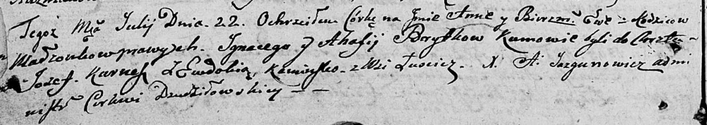

**Бритко Анна Игнатьева (Brytkowna Anna Ewa)**

22 июля 1805 г -- крещение (НИАБ 136-13-894, лист 57об, №33/1805-р
(ориг)).

**НИАБ 136-13-894:** Лист 57об. **Метрическая запись №33/1805-р
(ориг).**

{width="6.496527777777778in"
height="1.1499168853893262in"}

Дедиловичская Покровская церковь. 22 июля 1805 года. Метрическая запись
о крещении.

Brytkowna Anna Ewa -- дочь родителей с деревни Лустичи.

Brytko Jgnacy -- отец.

Brytkowa Ahafija -- мать.

Kurnesz Jozef -- кум.

Kaminska Ewdokija -- кума.

Jazgunowicz Antoni -- ксёндз.
