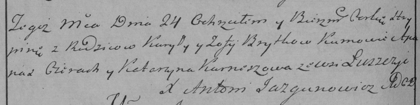

**Бритко Грыпина Курылова (Brytkowna Hrypina)**

24 мая 1786 г -- крещение (РГИА 823-2-18, лист 231об, №15/1786-р
(ориг)).

**РГИА 823-2-18:** Лист 231об. **Метрическая запись №15/1786-р (коп).**

{width="6.496527777777778in"
height="1.6243055555555554in"}

Дедиловичская Покровская церковь. 24 мая 1786 года. Метрическая запись о
крещении.

Brytkowna Hrypina -- дочь родителей с деревни Лустичи.

Brytko Kuryła -- отец.

Brytkowa Zofija -- мать.

Cierach Apanas -- кум.

Kurneszowa Katarzyna - кума.

Jazgunowicz Antoni -- ксёндз.
