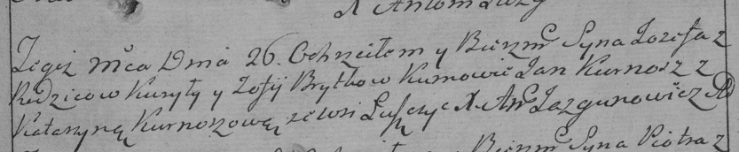

**Бритко Зофия (Brytkowa Zofija)**

24 мая 1786 г -- крещение дочери Грыпины (РГИА 823-2-18, лист 231об,
№15/1786-р (ориг)).

26 декабря 1788 г -- крещение сына Иосифа (НИАБ 136-13-894, лист 6,
№69/1788-р (ориг)), (РГИА 823-2-18, лист 237, №34/1788-р (коп)).

**РГИА 823-2-18:** Лист 231об. **Метрическая запись №15/1786-р (коп).**

{width="6.496527777777778in"
height="1.6243055555555554in"}

Дедиловичская Покровская церковь. 24 мая 1786 года. Метрическая запись о
крещении.

Brytkowna Hrypina -- дочь родителей с деревни Лустичи.

Brytko Kuryła -- отец.

Brytkowa Zofija -- мать.

Cierach Apanas -- кум.

Kurneszowa Katarzyna - кума.

Jazgunowicz Antoni -- ксёндз.

**НИАБ 136-13-894:** Лист 6. **Метрическая запись №69/1788-р (ориг).**

{width="6.496527777777778in"
height="0.6477077865266841in"}

Дедиловичская Покровская церковь. 26 декабря 1788 года. Метрическая
запись о крещении.

Brytka Jozef -- сын родителей с деревни Лустичи.

Brytka Kuryła-- отец.

Brytkowa Zofija -- мать.

Kurnesz Jan - кум.

Kurneszycha Katerzyna - кума.

Jazgunowicz Antoni -- ксёндз.

**РГИА 823-2-18:** Лист 237. **Метрическая запись №34/1788-р (коп).**

{width="6.496527777777778in"
height="1.3416666666666666in"}

Дедиловичская Покровская церковь. 26 декабря 1788 года. Метрическая
запись о крещении.

Brytko Jozef -- сын родителей с деревни Лустичи.

Brytko Kuryło -- отец.

Brytkowa Zofija -- мать.

Kurnesz Jan -- кум.

Kurnoszowa Katerzyna - кума.

Jazgunowicz Antoni -- ксёндз.
