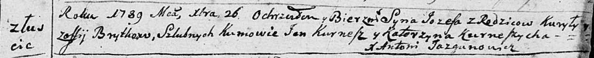

**Бритко Иосиф Кириллов (Brytka Jozef)**

26 декабря 1788 г -- крещение (НИАБ 136-13-894, лист 6, №69/1788-р
(ориг)), (РГИА 823-2-18, лист 237, №34/1788-р (коп)).

**НИАБ 136-13-894:** Лист 6. **Метрическая запись №69/1788-р (ориг).**

Дедиловичская Покровская церковь. 26 декабря 1788 года. Метрическая
запись о крещении.

Brytka Jozef -- сын родителей с деревни Лустичи.

Brytka Kuryła-- отец.

Brytkowa Zofija -- мать.

Kurnesz Jan - кум.

Kurneszycha Katerzyna - кума.

Jazgunowicz Antoni -- ксёндз.

**РГИА 823-2-18:** Лист 237. **Метрическая запись №34/1788-р (коп).**

Дедиловичская Покровская церковь. 26 декабря 1788 года. Метрическая
запись о крещении.

Brytko Jozef -- сын родителей с деревни Лустичи.

Brytko Kuryło -- отец.

Brytkowa Zofija -- мать.

Kurnesz Jan -- кум.

Kurnoszowa Katerzyna - кума.

Jazgunowicz Antoni -- ксёндз.
