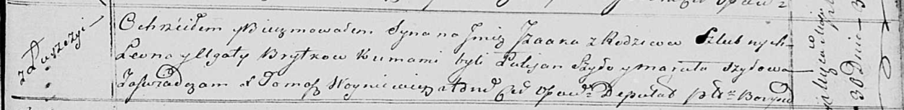

**Бритко Исаак Леонов (Brytko Izaak)**

30 мая 1820 -- крещение (НИАБ 136-13-894, лист 104, №16/1820-р (ориг)).

**НИАБ 136-13-894:** Лист 104. **Метрическая запись №16/1820-р (ориг).**

{width="6.496527777777778in"
height="0.7952198162729659in"}

Осовская Покровская церковь. 30 мая 1820 года. Метрическая запись о
крещении.

Brytko Jzaak -- сын родителей с деревни Лустичи.

Brytko Leon -- отец.

Brytkowa Agata -- мать.

Szyło Łukjan -- кум.

Szyłowa Maruta -- кума.

Woyniewicz Tomasz -- ксёндз.
