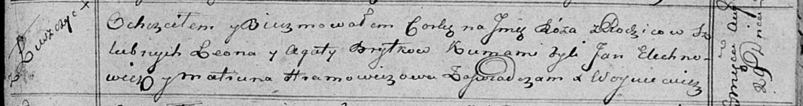

**Бритко Руза Леонова (Brytkowna Róza)**

29 августа 1815 -- крещение (НИАБ 136-13-894, лист 93, №36/1815-р
(ориг)).

**НИАБ 136-13-894:** Лист 93. **Метрическая запись №36/1815-р (ориг).**

Осовская Покровская церковь. 29 августа 1815 года. Метрическая запись о
крещении.

Brytkowna Róza -- дочь родителей с деревни Лустичи.

Brytko Leon -- отец.

Brytkowa Agata -- мать.

Elechnowicz Jan -- кум.

Hramowiczowa Matruna -- кума.

Woyniewicz Tomasz -- ксёндз.
