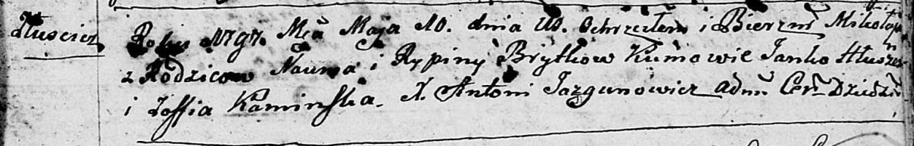
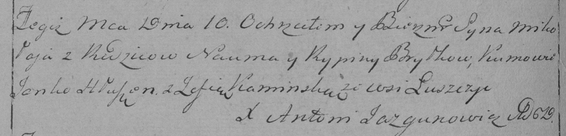

**Бритко Наум (Brytka Naum)**

10 мая 1797 г -- крещение сына Миколая (НИАБ 136-13-894, лист 33,
№30/1797-р (ориг)), (РГИА 823-2-18, лист 259об, №21/1797-р (коп)).

**НИАБ 136-13-894:** Лист 33. **Метрическая запись №30/1797-р (ориг).**

Дедиловичская Покровская церковь. 10 мая 1797 года. Метрическая запись о
крещении.

Brytko Mikołay -- сын родителей с деревни Лустичи.

Brytko Naum -- отец.

Brytkowa Rypina -- мать.

Hłuszeń Janko - кум.

Kaminska Zoffia - кума.

Jazgunowicz Antoni -- ксёндз.

**РГИА 823-2-18:** Лист 259об. **Метрическая запись №21/1797-р (коп).**

Дедиловичская Покровская церковь. 10 мая 1797 года. Метрическая запись о
крещении.

Brytko Mikołay -- сын родителей с деревни Лустичи.

Brytko Naum -- отец.

Brytkowa Rypina -- мать.

Hłuszeń Janko -- кум.

Kaminska Zofia -- кума.

Jazgunowicz Antoni -- ксёндз.
