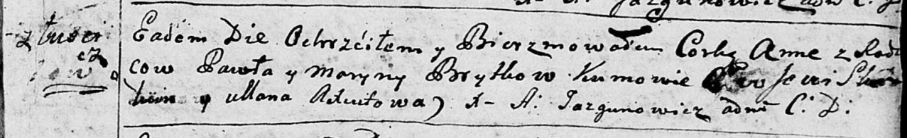

**Бритко Марына (Brytkowa Maryna)**

20 февраля 1793 г -- крещение дочери Анны (НИАБ 136-13-894, лист 19,
№21/1793-р (ориг)).

**НИАБ 136-13-894:** Лист 19. **Метрическая запись №21/1793-р (ориг).**

Дедиловичская Покровская церковь. 20 февраля 1793 года. Метрическая
запись о крещении.

Brytkowna Anna -- дочь родителей с деревни Лустичи.

Brytko Paweł -- отец.

Brytkowa Maryna -- мать.

Skakun Ewsewi - кум.

Axiutowa Ullana - кума.

Jazgunowicz Antoni -- ксёндз.
