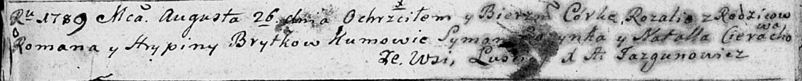
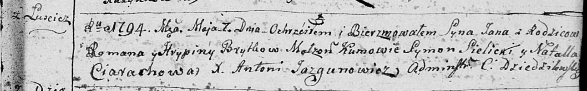

**Бритко Грыпина (Brytkowa Hrypina)**

26 августа 1789 г -- крещение дочери Розалии (НИАБ 136-13-894, лист 7об,
№41/1789-р (ориг)).

7 мая 1794 г -- крещение сына Яна (НИАБ 136-13-894, лист 22, №22/1794-р
(ориг)), (РГИА 823-2-18, лист 249об, №13/1794-р (коп)).

**НИАБ 136-13-894:** Лист 7об. **Метрическая запись №41/1789-р (ориг).**

Дедиловичская Покровская церковь. 26 августа 1789 года. Метрическая
запись о крещении.

Brytkowna Rozalia -- дочь родителей с деревни Лустичи.

Brytka Roman -- отец.

Brytkowa Hrypina -- мать.

Rozynka Symon - кум.

Cierachowa Natalla - кума.

Jazgunowicz Antoni -- ксёндз.

**НИАБ 136-13-894:** Лист 22. **Метрическая запись №22/1794-р (ориг).**

Дедиловичская Покровская церковь. 7 мая 1794 года. Метрическая запись о
крещении.

Brytka Jan -- сын родителей с деревни Лустичи.

Brytka Roman -- отец.

Brytkowa Hrypina -- мать.

Sielicki Symon - кум.

Ciarachowa Natalla - кума.

Jazgunowicz Antoni -- ксёндз.

**РГИА 823-2-18:** Лист 249об. **Метрическая запись №13/1794-р (коп).**

Дедиловичская Покровская церковь. 7 мая 1794 года. Метрическая запись о
крещении.

Brytko Jan -- сын родителей с деревни Лустичи.

Brytko Roman -- отец.

Brytkowa Hrypina -- мать.

Sielicki Symon -- кум.

Cierachowa Natalla -- кума.

Jazgunowicz Antoni -- ксёндз.
