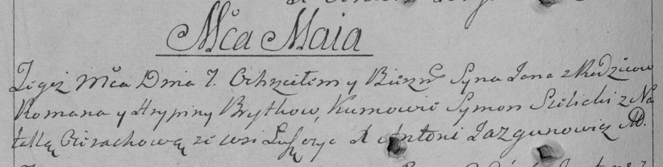

**Бритко Ян Романов (Brytka Jan)**

7 мая 1794 г -- крещение (НИАБ 136-13-894, лист 22, №22/1794-р (ориг)),
(РГИА 823-2-18, лист 249об, №13/1794-р (коп)).

**НИАБ 136-13-894:** Лист 22. **Метрическая запись №22/1794-р (ориг).**

{width="6.496527777777778in"
height="1.017156605424322in"}

Дедиловичская Покровская церковь. 7 мая 1794 года. Метрическая запись о
крещении.

Brytka Jan -- сын родителей с деревни Лустичи.

Brytka Roman -- отец.

Brytkowa Hrypina -- мать.

Sielicki Symon - кум.

Ciarachowa Natalla - кума.

Jazgunowicz Antoni -- ксёндз.

**РГИА 823-2-18:** Лист 249об. **Метрическая запись №13/1794-р (коп).**

{width="6.496527777777778in"
height="1.636111111111111in"}

Дедиловичская Покровская церковь. 7 мая 1794 года. Метрическая запись о
крещении.

Brytko Jan -- сын родителей с деревни Лустичи.

Brytko Roman -- отец.

Brytkowa Hrypina -- мать.

Sielicki Symon -- кум.

Cierachowa Natalla -- кума.

Jazgunowicz Antoni -- ксёндз.
