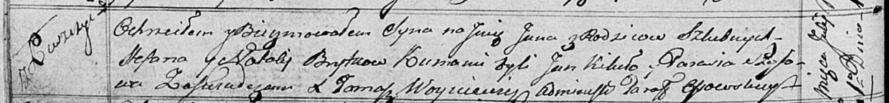

**Брытко (Курнеш) Наталья (Brytkowa (kurnaszowa) Natalija)**

1 ноября 1808 г -- венчание со Степаном Брыткой с деревни Лустичи (НИАБ
136-13-920, лист 14, №8/1808-б (ориг)).

1 июля 1817 г -- крещение сына Яна (НИАБ 136-13-894, лист 96об,
№43/1817-р (ориг)).

**НИАБ 136-13-920:** Лист 14. **Метрическая запись №8/1808-б (ориг).**

{width="6.496527777777778in"
height="1.3202252843394575in"}

Дедиловичская Покровская церковь. 1 ноября 1808 года. Метрическая запись
о венчании.

Brytka Sciepan -- жених, с деревни Лустичи.

Kurnaszowa Natalla -- невеста, с деревни Лустичи.

Skakun Nikiper -- свидетель, с деревни Лустичи.

Kurnesz Piatruś -- свидетель, с деревни Лустичи.

Jazgunowicz Antoni -- ксёндз.

**НИАБ 136-13-894:** Лист 96об. **Метрическая запись №43/1817-р
(ориг).**

{width="6.496527777777778in"
height="0.7549890638670166in"}

Осовская Покровская церковь. 1 июля 1817 года. Метрическая запись о
крещении.

Brytko Jan -- сын родителей с деревни Лустичи.

Brytko Stefan -- отец.

Brytkowa Natalija -- мать.

Kikiło Jan -- кум.

Szosowa? Parasia -- кума.

Woyniewicz Tomasz -- ксёндз.
