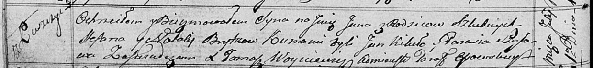

**Брытко Ян Степанов (Brytko Jan)**

1 июля 1817 г -- крещение (НИАБ 136-13-894, лист 96об, №43/1817-р
(ориг)).

**НИАБ 136-13-894:** Лист 96об. **Метрическая запись №43/1817-р
(ориг).**

{width="6.496527777777778in"
height="0.7549890638670166in"}

Осовская Покровская церковь. 1 июля 1817 года. Метрическая запись о
крещении.

Brytko Jan -- сын родителей с деревни Лустичи.

Brytko Stefan -- отец.

Brytkowa Natalija -- мать.

Kikiło Jan -- кум.

Szosowa? Parasia -- кума.

Woyniewicz Tomasz -- ксёндз.
