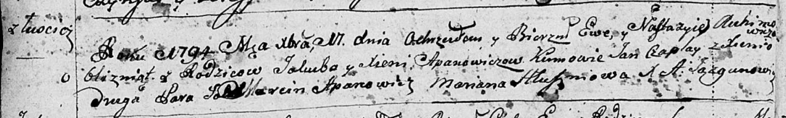

**Гапанович Настасья Якубова (Apanowiczowna Nastazyia)**

11 декабря 1794 г -- крещение (НИАБ 136-13-894, лист 23об, №61/1794-р
(ориг)).

**НИАБ 136-13-894:** Лист 23об. **Метрическая запись №61/1794-р
(ориг).**

{width="6.496527777777778in"
height="0.9775973315835521in"}

Дедиловичская Покровская церковь. 11 декабря 1794 года. Метрическая
запись о крещении.

Apanowiczowna Ewa -- дочь родителей с деревни Лустичи.

Apanowiczowna Nastazyia -- дочь.

Apanowicz Jakub -- отец.

Apanowiczowa Xienia -- мать.

Czaplay Jan - кум, крестный отец Евы.

Auchimowiczowa Xienia -- кума, крестная мать Евы.

Apanowicz Marcin - кум, крестный отец Анастасии.

Hłuszniowa Marjana - кума, крестная мать Анастасии.

Jazgunowicz Antoni -- ксёндз.
