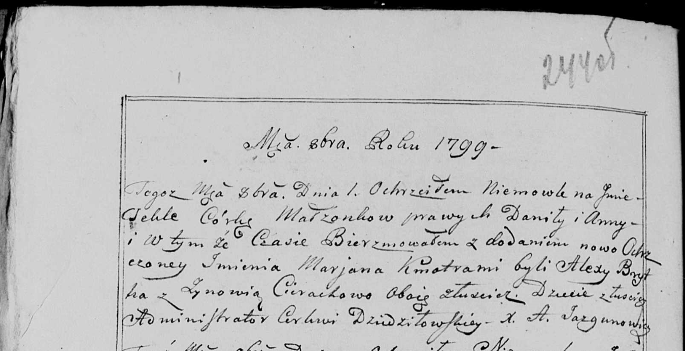

**Дедёнок Анна (Dziandzionkowa Anna)**

4 декабря 1790 г -- крещение дочери Варвары (НИАБ 136-13-894, лист 12,
№88/1790-р (ориг)) (РГИА 823-2-18, лист 241, №34/1790-р (коп)).

1 октября 1799 г -- крещение дочери Текли Марьяны (НИАБ 136-13-938, лист
244об, №37/1799-р (коп))

**НИАБ 136-13-894:** Лист 12. **Метрическая запись №88/1790-р (ориг).**

{width="6.496527777777778in"
height="1.084207130358705in"}

Дедиловичская Покровская церковь. 4 декабря 1790 года. Метрическая
запись о крещении.

Dziandzionkowna Barbara -- дочь родителей с деревни Лустичи.

Dziandzionak Daniła -- отец, деревня Лустичи.

Dziandzionkowa Anna -- мать, деревня Лустичи.

Brytka Alexiey - кум.

Ciorochowa Zynowija - кума.

Jazgunowicz Antoni -- ксёндз.

**РГИА 823-2-18:** Лист 241. **Метрическая запись №34/1790-р (коп).**

{width="6.496527777777778in"
height="1.3298611111111112in"}

Дедиловичская Покровская церковь. 4 декабря 1790 года. Метрическая
запись о крещении.

Dziandzionkowna Barbara -- дочь родителей с деревни Лустичи.

Dziandzionek Daniło -- отец.

Dziandzionkowa Anna -- мать.

Brytka Alaxiey -- кум.

Ciarochowa Zynowia - кума.

Jazgunowicz Antoni -- ксёндз.

**НИАБ 136-13-938:** Лист 244об. **Метрическая запись №37/1799-р
(коп).**

(См. тж. НИАБ 136-13-894, лист 39об, №39/1799-р (ориг), РГИА 823-2-18,
лист 272об, №38/1799-р (коп))

{width="6.496527777777778in"
height="3.334722222222222in"}

Дедиловичская Покровская церковь. 1 октября 1799 года. Метрическая
запись о крещении.

\[Dziedzeńkowna\] Tekla Marjana -- дочь родителей с деревни Лустичи.

\[Dziedzenok\] Daniła -- отец.

\[Dziedzeńkowa\] Anna -- мать.

Brytka Alexy -- кум, с деревни Лустичи.

Cierachowa Zynowia - кума, с деревни Лустичи.

Jazgunowicz Antoni -- ксёндз.
