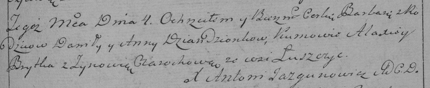

**Дедёнок Варвара Данилова (Dziandzionkowna Barbara)**

4 декабря 1790 г -- крещение (НИАБ 136-13-894, лист 12, №88/1790-р
(ориг)) (РГИА 823-2-18, лист 241, №34/1790-р (коп)).

**НИАБ 136-13-894:** Лист 12. **Метрическая запись №88/1790-р (ориг).**

{width="6.496527777777778in"
height="1.084207130358705in"}

Дедиловичская Покровская церковь. 4 декабря 1790 года. Метрическая
запись о крещении.

Dziandzionkowna Barbara -- дочь родителей с деревни Лустичи.

Dziandzionak Daniła -- отец, деревня Лустичи.

Dziandzionkowa Anna -- мать, деревня Лустичи.

Brytka Alexiey - кум.

Ciorochowa Zynowija - кума.

Jazgunowicz Antoni -- ксёндз.

**РГИА 823-2-18:** Лист 241. **Метрическая запись №34/1790-р (коп).**

{width="6.496527777777778in"
height="1.3298611111111112in"}

Дедиловичская Покровская церковь. 4 декабря 1790 года. Метрическая
запись о крещении.

Dziandzionkowna Barbara -- дочь родителей с деревни Лустичи.

Dziandzionek Daniło -- отец.

Dziandzionkowa Anna -- мать.

Brytka Alaxiey -- кум.

Ciarochowa Zynowia - кума.

Jazgunowicz Antoni -- ксёндз.
