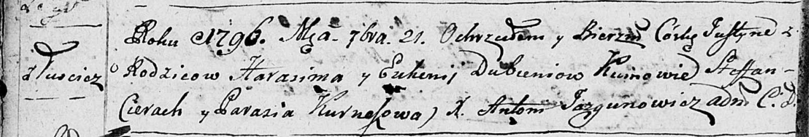

**Дубень Евгения (Dubieniowa Euhenija)**

21 сентября 1796 г -- крещение дочери Юстыны (НИАБ 136-13-894, лист
30об, №81/1796-р (ориг)).

**НИАБ 136-13-894:** Лист 30-об. **Метрическая запись №81/1796-р
(ориг).**

Дедиловичская Покровская церковь. 21 сентября 1796 года. Метрическая
запись о крещении.

Dubniowna Justyna -- дочь родителей с деревни Лустичи.

Dubień Harasim -- отец.

Dubniowa Euhenija -- мать.

Cierach Stefan -- кум.

Kurneszowa Parasia - кума.

Jazgunowicz Antoni -- ксёндз.
