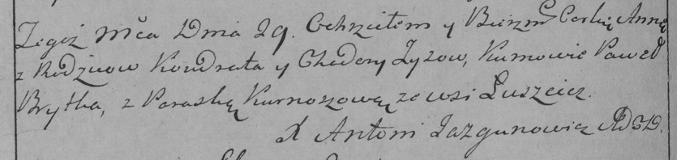

**Зыз Кондрат (Zyz Kondrat)**

29 августа 1787 г -- крещение дочери Анны (НИАБ 136-13-894, лист 2об,
№41/1787-р (ориг)), (РГИА 823-2-18, лист 234об, №24/1787-р (коп)).

**НИАБ 136-13-894:** Лист 2об. **Метрическая запись №41/1787-р (ориг).**

{width="6.496527777777778in"
height="0.7925371828521435in"}

Дедиловичская Покровская церковь. 29 августа 1787 года. Метрическая
запись о крещении.

Zyzowna Anna - дочь родителей с деревни Лустичи.

Zyz Kondrat -- отец.

Zyzowa Chodora -- мать.

Brytko Pawel - кум.

Kurnoszycha Paraska - кума.

Jazgunowicz Antoniusz -- ксёндз.

**РГИА 823-2-18:** Лист 234об. **Метрическая запись №24/1787-р (коп).**

{width="6.496527777777778in"
height="1.5402777777777779in"}

Дедиловичская Покровская церковь. 29 августа 1787 года. Метрическая
запись о крещении.

Zyzowna Anna -- дочь родителей с деревни Лустичи.

Zyz Kondrat -- отец.

Zyzowa Chodora -- мать.

Brytka Paweł -- кум.

Kurnoszowa Paraska - кума.

Jazgunowicz Antoni -- ксёндз.
