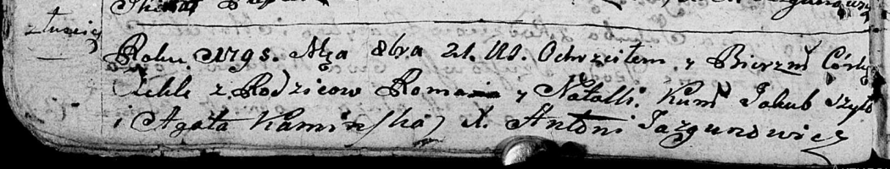
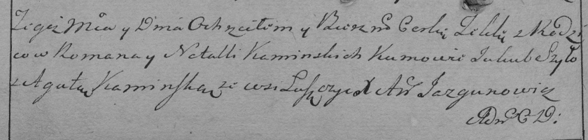

**Каминский Роман (Kaminski Roman)**

21 октября 1795 г -- крещение дочери Текли (НИАБ 136-13-894, лист 10об,
№54/1790-р (ориг)), (РГИА 823-2-18, лист 253об, №38/1795-р (коп)).

**НИАБ 136-13-894:** Лист 25об. **Метрическая запись №45/1795-р
(ориг).**

Дедиловичская Покровская церковь. 21 октября 1795 года. Метрическая
запись о крещении.

\[Kaminska\] Tekla -- дочь родителей с деревни Лустичи.

\[Kaminski\] Roman -- отец.

\[Kaminska\] Natalla -- мать.

Szyło Jakub - кум.

Kaminska Agata - кума.

Jazgunowicz Antoni -- ксёндз.

**РГИА 823-2-18:** Лист 253об. **Метрическая запись №38/1795-р (коп).**

Дедиловичская Покровская церковь. \[21\] октября 1795 года. Метрическая
запись о крещении.

Kaminska Tekla -- дочь родителей с деревни Лустичи.

Kaminski Roman -- отец.

Kaminska Natalla -- мать.

Szyło Jakub -- кум.

Kaminska Agata -- кума.

Jazgunowicz Antoni -- ксёндз.
