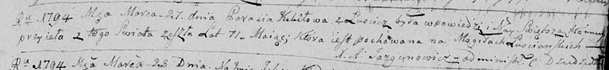

**Кикило Парася (Kikiłowa Parasia)**

27 марта 1794 г -- отпевание, с деревни Лустичи, умерла в возрасте 71
год (родилась около 1723 г) (НИАБ 136-13-919, лист 2, №18/1794-у
(ориг)).

**НИАБ 136-13-919:** Лист 2. **Метрическая запись №18/1794-у (ориг).**

Дедиловичская Покровская церковь. 27 марта 1794 года. Метрическая запись
об отпевании.

Kikiłowa Parasia -- умершая, 71 года, с деревни Лустичи, похоронена на
кладбище деревни Лустичи.

Jazgunowicz Antoni -- ксёндз.
