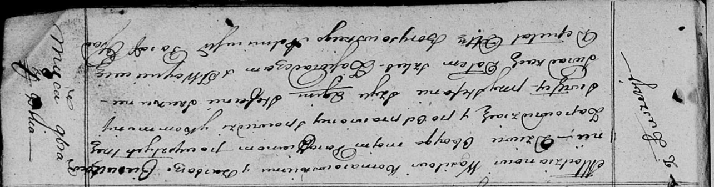
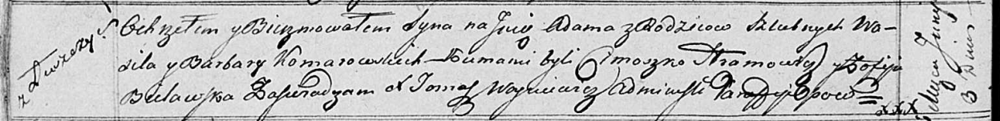
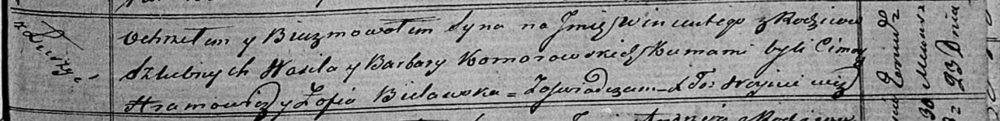

**Комаровский Василь (Komarowski Wasil)**

7 ноября 1815 г -- венчание с девкой Варварой Церах (НИАБ 136-13-920,
лист 22, №8/1815-б (ориг)).

3 июня 1817 г -- крещение сына Адама (НИАБ 136-13-894, лист 96об,
№39/1817-р (ориг)).

23 ноября 1819 г -- крещение сына Винцентыя (НИАБ 136-13-894, лист 103,
№60/1819-р (ориг)).

**НИАБ 136-13-920:** Лист 22. **Метрическая запись №8/1815-б (ориг).**

Осовская Покровская церковь. 7 ноября 1815 года. Запись о венчании.

Komarowski Wasil -- жених, молодой, парафии Осовской, с деревни Лустичи.

Cierachowna Barbara -- невеста, девка, парафии Осовской.

Szyło Stefan -- свидетель.

Skakun Stefan -- свидетель.

Woyniewicz Tomasz -- ксёндз.

**НИАБ 136-13-894:** Лист 96об. **Метрическая запись №39/1817-р
(ориг).**

Осовская Покровская церковь. 3 июня 1817 года. Метрическая запись о
крещении.

Komarowski Adam -- сын родителей с деревни Лустичи.

Komarowski Wasil -- отец.

Komarowska Barbara -- мать.

Hromowicz Cimoszko -- кум.

Bielawska Zofija -- кума.

Woyniewicz Tomasz -- ксёндз.

**НИАБ 136-13-894:** Лист 103. **Метрическая запись №60/1819-р (ориг).**

Осовская Покровская церковь. 23 ноября 1819 года. Метрическая запись о
крещении.

Komarowski Wincenty -- сын родителей с деревни Лустичи.

Komarowski Wasil -- отец.

Komarowska Barbara -- мать.

Hramowicz Cimoch -- кум.

Bielawska Zofija -- кума.

Woyniewicz Tomasz -- ксёндз.
