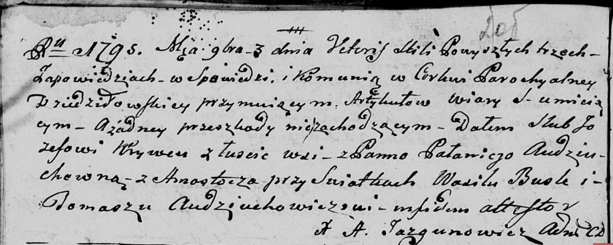

**Кривец Иосиф (Krywiec Jozef)**

3 ноября 1795 г -- венчание с Полонеей Авдюхович с деревни Замосточье,
супруги живут в деревне Замосточье (НИАБ 136-13-920, лист 2об, №7/1795-б
(ориг)).

**НИАБ 136-13-920:** Лист 2об. **Метрическая запись №7/1795-б (ориг).**

{width="6.496527777777778in"
height="2.6035728346456692in"}

Дедиловичская Покровская церковь. 3 ноября 1795 года. Метрическая запись
о венчании.

Krywiec Jozef -- жених, деревня Лустичи.

Audziuchowichоwna Palanieja -- невеста, деревня Замосточье.

Busła Wasil -- свидетель.

Audziuchowicz Tomasz -- свидетель.

Jazgunowicz Antoni -- ксёндз.
