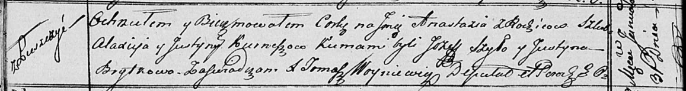

**Курнеш Аляксей (Kurnesz Alaxiey)**

31 января 1817 г -- крещение дочери Анастасии (НИАБ 136-13-894, лист
95об, №8/1817-р (ориг)).

**НИАБ 136-13-894:** Лист 95об. **Метрическая запись №8/1817-р (ориг).**

Осовская Покровская церковь. 31 января 1817 года. Метрическая запись о
крещении.

Kurneszowna Anastazia -- дочь родителей с деревни Лустичи.

Kurnesz Alaxiey -- отец.

Kurneszowa Justyna -- мать.

Szyło Jozef -- кум.

Brytkowa Justyna -- кума.

Woyniewicz Tomasz -- ксёндз.
