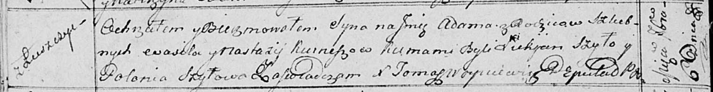

**Курнеш Адам Василев (Kurnesz Adam)**

6 сентября 1814 г -- крещение (НИАБ 136-13-894, лист 90об, №51/1814-р
(ориг)).

**НИАБ 136-13-894:** Лист 90об. **Метрическая запись №51/1814-р
(ориг).**

Осовская Покровская церковь. 6 сентября 1814 года. Метрическая запись о
крещении.

Kurnesz Adam -- сын родителей с деревни Лустичи.

Kurnesz Wasil -- отец.

Kurneszowa Nastazija -- мать.

Szyło Łukjan -- кум.

Szyłowa Połonija -- кума.

Woyniewicz Tomasz -- ксёндз.
