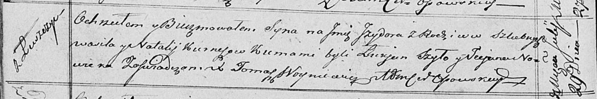

**Курнеш Василь (Kurnesz Wasil)**

24 января 1809 г -- венчание с девкой Натальей Ксёнжник с деревни
Васильковка (НИАБ 136-13-920, лист 14об, №2/1809-б (ориг)).

29 июля 1818 г -- крещение сына Изыдора (НИАБ 136-13-894, лист 98об,
№24/1818-р (ориг)).

**НИАБ 136-13-920:** Лист 14об. **Метрическая запись №2/1809-б (ориг).**

{width="6.496527777777778in"
height="1.8961898512685915in"}

Дедиловичская Покровская церковь. 24 января 1809 года. Метрическая
запись о венчании.

Kurnesz Wasil -- жених, с деревни Лустичи.

Xięznikowa Natalla -- невеста, девка, с деревни Васильковка.

Brytka Chwiedor -- свидетель, с деревни Лустичи.

Szyło Nikiper -- свидетель, с деревни Васильковка.

Jazgunowicz Antoni -- ксёндз.

**НИАБ 136-13-894:** Лист 98об. **Метрическая запись №24/1818-р
(ориг).**

{width="6.496527777777778in"
height="1.0909120734908135in"}

Осовская Покровская церковь. 29 июля 1818 года. Метрическая запись о
крещении.

Kurnesz Jzydor -- сын родителей с деревни Лустичи.

Kurnesz Wasil -- отец.

Kurnieszowa Natalija -- мать.

Szyło Łukjan -- кум.

Nowicka Taciana -- кума.

Woyniewicz Tomasz -- ксёндз.
