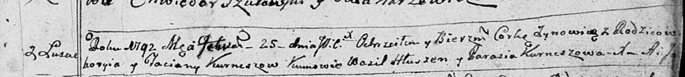

**Курнеш Ева Грыгорова (Kurnaszowna Ewa)**

17 декабря 1788 г -- крещение (НИАБ 136-13-894, лист 6, №67/1788-р
(ориг)).

**НИАБ 136-13-894:** Лист 6. **Метрическая запись №67/1788-р (ориг).**

{width="6.496527777777778in"
height="1.2042279090113737in"}

Дедиловичская Покровская церковь. 17 декабря 1788 года. Метрическая
запись о крещении.

Kurnaszowna Ewa -- дочь родителей с деревни Лустичи.

Kurnasz Gregorz -- отец.

Kurnaszowa Teciana -- мать.

Hłuszeń Astapka - кум.

Axiutowa Anna - кума.
