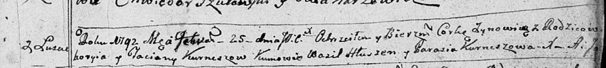
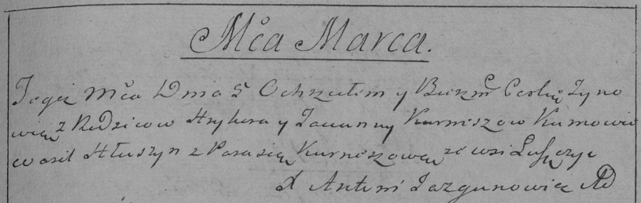

**Курнеш Зыновия Грыгорова (Kurneszowna Zynowija)**

25 февраля 1792 г -- крещение (НИАБ 136-13-894, лист 15, №9/1792-р
(ориг)), (РГИА 823-2-18, лист 244, №4/1792-р (коп)).

Лист 15. **Метрическая запись №9/1792-р (ориг).**

Дедиловичская Покровская церковь. 25 февраля 1792 года. Метрическая
запись о крещении.

Kurneszowna Zynowija -- дочь родителей с деревни Лустичи.

Kurnesz Hrehory -- отец.

Kurneszowa Taciana -- мать.

Hłuszen Wasil -- кум.

Kurneszowa Parasia - кума.

Jazgunowicz Antoni -- ксёндз.

**РГИА 823-2-18:** Лист 244. **Метрическая запись №4/1792-р (коп).**

Дедиловичская Покровская церковь. \[25 февраля\] 1792 года. Метрическая
запись о крещении.

Kurneszowna Zynowia -- дочь родителей с деревни Лустичи.

Kurnesz Hryhor -- отец.

Kurneszowa Tacianna -- мать.

Hłuszyn Wasil -- кум.

Kurneszowa Parasia - кума.

Jazgunowicz Antoni -- ксёндз.
