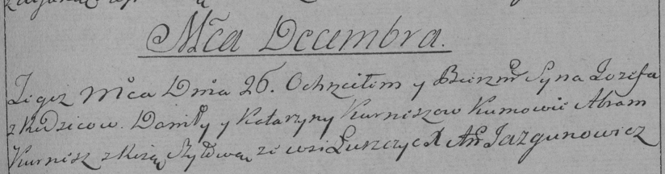

**Курнеш Иосиф Данилов (Kurnesz Jozef)**

26 декабря 1789 г -- крещение (НИАБ 136-13-894, лист 8об, №64/1789-р
(ориг)), (РГИА 823-2-18, лист 239, №30/1789-р (коп)).

**НИАБ 136-13-894:** Лист 8об. **Метрическая запись №64/1789-р (ориг).**

{width="6.496527777777778in"
height="1.695038276465442in"}

Дедиловичская Покровская церковь. 26 декабря 1789 года. Метрическая
запись о крещении.

Kurnesz Jozef -- сын родителей с деревни Лустичи.

Kurnesz Daniła -- отец.

Kurneszowa Katerzyna -- мать.

Kurnesz Abram - кум.

Szyłowa Roza - кума.

Jazgunowicz Antoni -- ксёндз.

**РГИА 823-2-18:** Лист 239. **Метрическая запись №30/1789-р (коп).**

{width="6.496527777777778in"
height="1.7027777777777777in"}

Дедиловичская Покровская церковь. 26 декабря 1789 года. Метрическая
запись о крещении.

Kurnesz Jozef -- сын родителей с деревни Лустичи.

Kurnesz Daniło -- отец.

Kurneszowa Katarzyna -- мать.

Kurnesz Abram -- кум.

Szyłowa Róza - кума.

Jazgunowicz Antoni -- ксёндз.
