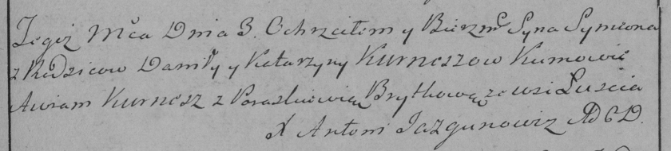
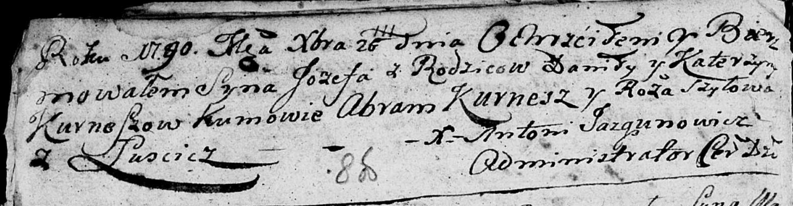
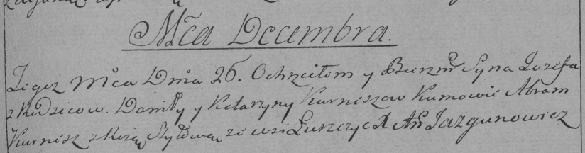
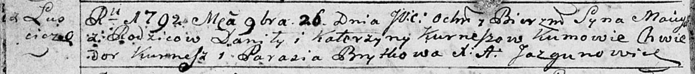

**Курнеш Катерына (Kurneszowa Katerzyna)**

3 февраля 1786 г -- крещение сына Сымона (РГИА 823-2-18, лист 231,
№5/1786-р (коп)).

26 декабря 1789 г -- крещение сына Иосифа (НИАБ 136-13-894, лист 8об,
№64/1789-р (ориг)), (РГИА 823-2-18, лист 239, №30/1789-р (коп)).

26 ноября 1792 г -- крещение сына Мацея (НИАБ 136-13-894, лист 17об,
№79/1792-р (ориг)).

**РГИА 823-2-18:** Лист 231. **Метрическая запись №5/1786-р (коп).**

Дедиловичская Покровская церковь. 3 февраля 1786 года. Метрическая
запись о крещении.

Kurnesz Symeon -- сын родителей с деревни Лустичи.

Kurnesz Daniła -- отец.

Kurneszowa Katarzyna -- мать.

Kurnesz Auram -- кум.

Brytkowa Paraskiewia - кума.

Jazgunowicz Antoni -- ксёндз.

**НИАБ 136-13-894:** Лист 8об. **Метрическая запись №64/1789-р (ориг).**

Дедиловичская Покровская церковь. 26 декабря 1789 года. Метрическая
запись о крещении.

Kurnesz Jozef -- сын родителей с деревни Лустичи.

Kurnesz Daniła -- отец.

Kurneszowa Katerzyna -- мать.

Kurnesz Abram - кум.

Szyłowa Roza - кума.

Jazgunowicz Antoni -- ксёндз.

**РГИА 823-2-18:** Лист 239. **Метрическая запись №30/1789-р (коп).**

Дедиловичская Покровская церковь. 26 декабря 1789 года. Метрическая
запись о крещении.

Kurnesz Jozef -- сын родителей с деревни Лустичи.

Kurnesz Daniło -- отец.

Kurneszowa Katarzyna -- мать.

Kurnesz Abram -- кум.

Szyłowa Róza - кума.

Jazgunowicz Antoni -- ксёндз.

**НИАБ 136-13-894:** Лист 17-об. **Метрическая запись №79/1792-р
(ориг).**

Дедиловичская Покровская церковь. 26 ноября 1792 года. Метрическая
запись о крещении.

Kurnesz Maciey -- сын родителей с деревни Лустичи.

Kurnesz Daniła -- отец.

Kurneszowa Katerzyna -- мать.

Kurnesz Chwiedor - кум.

Brytkowa Parasia - кума.

Jazgunowicz Antoni -- ксёндз.
