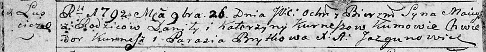

**Курнеш Мацей Данилов (Kurnesz Maciey)**

26 ноября 1792 г -- крещение (НИАБ 136-13-894, лист 17об, №79/1792-р
(ориг)).

**НИАБ 136-13-894:** Лист 17-об. **Метрическая запись №79/1792-р
(ориг).**

{width="6.496527777777778in"
height="0.7006780402449694in"}

Дедиловичская Покровская церковь. 26 ноября 1792 года. Метрическая
запись о крещении.

Kurnesz Maciey -- сын родителей с деревни Лустичи.

Kurnesz Daniła -- отец.

Kurneszowa Katerzyna -- мать.

Kurnesz Chwiedor - кум.

Brytkowa Parasia - кума.

Jazgunowicz Antoni -- ксёндз.
