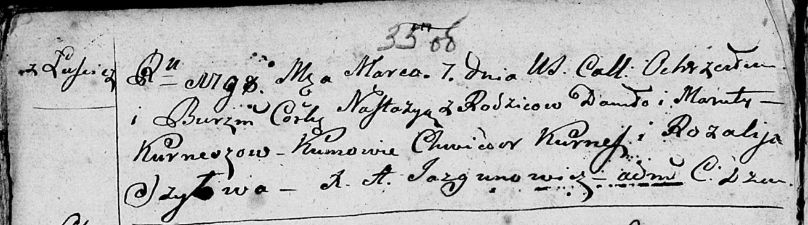
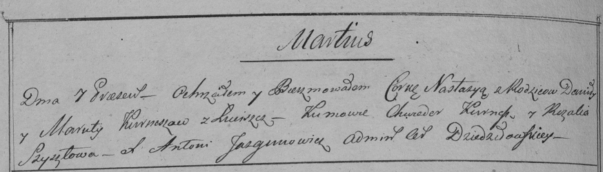

**Курнеш Данила (Kurnesz Daniło)**

29 мая 1793 г -- венчание с Марутой Шило с деревни Шилы (НИАБ
136-13-894, лист 71об, №3/1793-б (ориг)).

7 марта 1798 г -- крещение дочери Настасьи (НИАБ 136-13-894, лист 35об,
№8/1798-р (ориг)), (РГИА 823-2-18, лист 262об, №8/1798-р (коп)).

**НИАБ 136-13-894:** Лист 71об. **Метрическая запись №3/1793-б (ориг).**

Дедиловичская Покровская церковь. 29 мая 1793 года. Метрическая запись о
венчании.

Kurnesz Daniło -- жених, вдовец, с деревни Лустичи.

Szyłowa Maruta -- невеста, вдова, с деревни Шилы.

Szyło Paweł -- свидетель, с деревни Васильковка.

Jazgunowicz Antoni -- ксёндз.

**НИАБ 136-13-894:** Лист 35об. **Метрическая запись №8/1798-р (ориг).**

Дедиловичская Покровская церковь. 7 марта 1798 года. Метрическая запись
о крещении.

Kurneszowna Nastazyia -- дочь родителей с деревни Лустичи.

Kurnesz Daniło -- отец.

Kurneszowa Maruta -- мать.

Kurnesz Chwiedor - кум.

Szyłowa Rozalija - кума.

Jazgunowicz Antoni -- ксёндз.

**РГИА 823-2-18:** Лист 262об. **Метрическая запись №8/1798-р (коп).**

Дедиловичская Покровская церковь. 7 марта 1798 года. Метрическая запись
о крещении.

Kurneszowna Nastazya -- дочь родителей с деревни Лустичи.

Kurnesz Daniło -- отец.

Kurneszowa Maruta -- мать.

Kurnesz Chwiedor -- кум.

Szyłowa Rozalia -- кума.

Jazgunowicz Antoni -- ксёндз.
