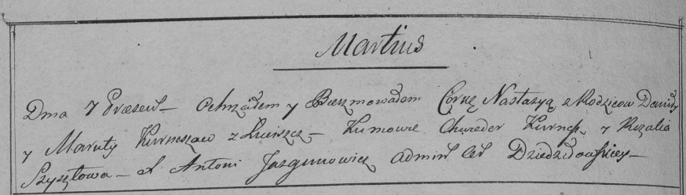

**Курнеш Настасья Данилова (Kurneszowna Nastazyia)**

7 марта 1798 г -- крещение (НИАБ 136-13-894, лист 35об, №8/1798-р
(ориг)), (РГИА 823-2-18, лист 262об, №8/1798-р (коп)).

**НИАБ 136-13-894:** Лист 35-об. **Метрическая запись №8/1798-р
(ориг).**

{width="6.496527777777778in"
height="1.8170702099737532in"}

Дедиловичская Покровская церковь. 7 марта 1798 года. Метрическая запись
о крещении.

Kurneszowna Nastazyia -- дочь родителей с деревни Лустичи.

Kurnesz Daniło -- отец.

Kurneszowa Maruta -- мать.

Kurnesz Chwiedor - кум.

Szyłowa Rozalija - кума.

Jazgunowicz Antoni -- ксёндз.

**РГИА 823-2-18:** Лист 262об. **Метрическая запись №8/1798-р (коп).**

{width="6.496527777777778in"
height="1.8506944444444444in"}

Дедиловичская Покровская церковь. 7 марта 1798 года. Метрическая запись
о крещении.

Kurneszowna Nastazya -- дочь родителей с деревни Лустичи.

Kurnesz Daniło -- отец.

Kurneszowa Maruta -- мать.

Kurnesz Chwiedor -- кум.

Szyłowa Rozalia -- кума.

Jazgunowicz Antoni -- ксёндз.
