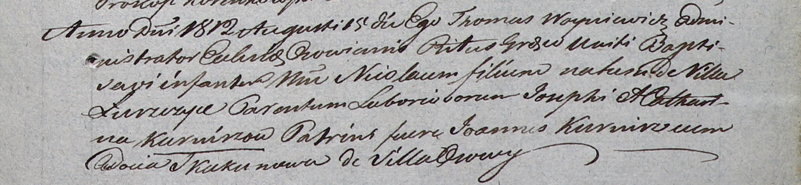

**Курнеш Иосиф (Kurnesz Jozef, Joseph)**

21 июня 1799 г -- крещение дочери Магдалены (НИАБ 1781-27-199, лист 128,
№31/1799-р).

29 апреля 1806 г -- крещение дочери Паланеи (НИАБ 136-13-894, лист 60,
№22/1806-р (ориг)).

8 августа 1809 г -- крещение сына Тадея (НИАБ 136-13-894, лист 75,
№38/1809-р (ориг)).

15 августа 1812 г -- крещение сына Николая (НИАБ 937-4-32, лист 25,
№22/1812-р).

**НИАБ 1781-27-199:** Лист 128. **Метрическая запись №31/1799-р.**

Дедиловичский костел Наисвятейшего Сердца Иисуса. 21 июля 1799 года.
Метрическая запись о крещении.

Kurnaszowna Magdalena -- дочь крестьян с деревни Лустичи.

Kurnasz Joseph -- отец.

Kurnaszowa Catharina -- мать.

Kurnasz Joann -- крестный отец.

Skakunicha Audocia -- крестная мать.

Linhart Hyacinthus -- ксёндз.

**НИАБ 136-13-894:** Лист 60. **Метрическая запись №22/1806-р (ориг).**

Дедиловичская Покровская церковь. 29 апреля 1806 года. Метрическая
запись о крещении.

Kurneszowna Pałanija -- дочь родителей с деревни Лустичи.

Kurnesz Jozef -- отец.

Kurneszowa Katerzyna -- мать.

Kurnesz Jan -- кум.

Skakunowa Ewdokia -- кума.

Jazgunowicz Antoni -- ксёндз.

**НИАБ 136-13-894:** Лист 75. **Метрическая запись №38/1809-р (ориг).**

Дедиловичская Покровская церковь. 8 августа 1809 года. Метрическая
запись о крещении .

Kurnesz Tadeusz -- сын родителей с деревни Лустичи.

Kurnesz Jozef -- отец.

Kurneszowa Katerzyna -- мать.

Kurnesz Jan -- кум.

Skakunowa Ewdokija -- кума.

Jazgunowicz Antoni -- ксёндз.

**НИАБ 937-4-32:** Лист 25. **Метрическая запись №22/1812-р.**

Дедиловичский костел Наисвятейшего Сердца Иисуса. 15 августа 1812 года.
Метрическая запись о крещении.

Kurnisz Nicołay -- сын крестьян с деревни Лустичи.

Kurnisz Joseph -- отец.

Kurniszowa Catharina -- мать.

Kurnisz Joann -- крестный отец.

Skakunowa Audocia -- крестная мать, с деревни Осово.

Woyniewicz Thomas -- ксёндз, администратор Осовский.
