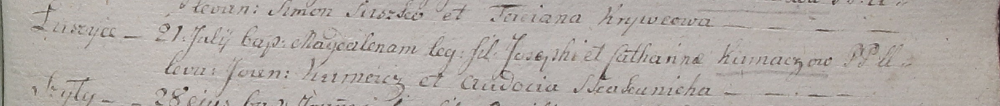

**Курнеш Магдалена Иосифова (Kurneszowna Magdalena)**

21 июня 1799 г -- крещение дочери Магдалены (НИАБ 1781-27-199, лист 128,
№31/1799-р).

**НИАБ 1781-27-199:** Лист 128. **Метрическая запись №31/1799-р.**

Дедиловичский костел Наисвятейшего Сердца Иисуса. 21 июля 1799 года.
Метрическая запись о крещении.

Kurnaszowna Magdalena -- дочь крестьян с деревни Лустичи.

Kurnasz Joseph -- отец.

Kurnaszowa Catharina -- мать.

Kurnasz Joann -- крестный отец.

Skakunicha Audocia -- крестная мать.

Linhart Hyacinthus -- ксёндз.
