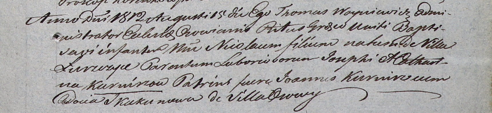

**Курнеш Николай Иосифов (Kurnisz Nicołay)**

15 августа 1812 г -- крещение (НИАБ 937-4-32, лист 25, №22/1812-р).

**НИАБ 937-4-32:** Лист 25. **Метрическая запись №22/1812-р.**

{width="6.496527777777778in"
height="1.50625in"}

Дедиловичский костел Наисвятейшего Сердца Иисуса. 15 августа 1812 года.
Метрическая запись о крещении.

Kurnisz Nicołay -- сын крестьян с деревни Лустичи.

Kurnisz Joseph -- отец.

Kurniszowa Catharina -- мать.

Kurnisz Joann -- крестный отец.

Skakunowa Audocia -- крестная мать, с деревни Осово.

Woyniewicz Thomas -- ксёндз, администратор Осовский.
