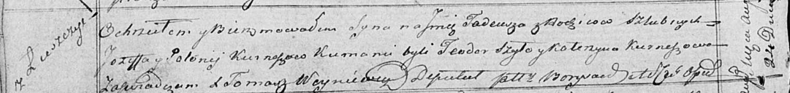

**Курнеш (в девичестве Селицкая) Полония (Kurneszowa Połonija z
Siellickich)**

13 ноября 1815 г -- венчание с молодым Иосифом Курнешом с деревни
Лустичи (НИАБ 136-13-920, лист 22об, №12/1815-б (ориг)).

24 августа 1819 г -- крещение сына Тадея (НИАБ 136-13-894, лист 101об,
№46/1819-р (ориг)).

**НИАБ 136-13-920:** Лист 22об. **Метрическая запись №12/1815-б
(ориг).**

{width="6.496527777777778in"
height="1.2706080489938758in"}

Осовская Покровская церковь. 13 ноября 1815 года. Запись о венчании.

Kurnesz Jozef -- жених, молодой, парафии Осовской, с деревни Лустичи.

Siellicka Połonija -- невеста, девка, парафии Осовской.

Szapielewicz Dzemjan -- свидетель.

Kurnesz Jan -- свидетель.

Woyniewicz Tomasz -- ксёндз.

**НИАБ 136-13-894:** Лист 101об. **Метрическая запись №46/1819-р
(ориг).**

{width="6.496527777777778in"
height="0.7704111986001749in"}

Осовская Покровская церковь. 24 августа 1819 года. Метрическая запись о
крещении.

Kurnesz Tadeusz -- сын родителей с деревни Лустичи.

Kurnesz Jozef -- отец.

Kurneszowa Połonija -- мать.

Szyło Teodor -- кум.

Kurneszowa Katerzyna -- кума.

Woyniewicz Tomasz -- ксёндз.
