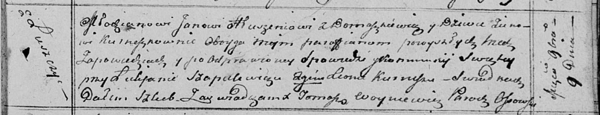

**Глушень (в девичестве Курнеш) Зеновия (Hłuszniowa, Hłuszaninowa
Zienowija z Kurneszkow)**

9 ноября 1813 г -- венчание с молодым Яном Глушнем с деревни Домашковичи
(НИАБ 136-13-920, лист 20, №21/1813-б (ориг).

**НИАБ 136-13-920:** Лист 20. **Метрическая запись №21/1813-б (ориг).**

Осовская Покровская церковь. 9 ноября 1813 года. Запись о венчании.

Hłuszeń Jan -- жених, молодой, парафии Осовской, с деревни Домашковичи.

Kurneszkowna Zienowija -- невеста, девка, парафии Осовской, с деревни
Лустичи.

Szapielewicz Łukjan -- свидетель.

Kurnesz Leon -- свидетель.

Woyniewicz Tomasz -- ксёндз.
